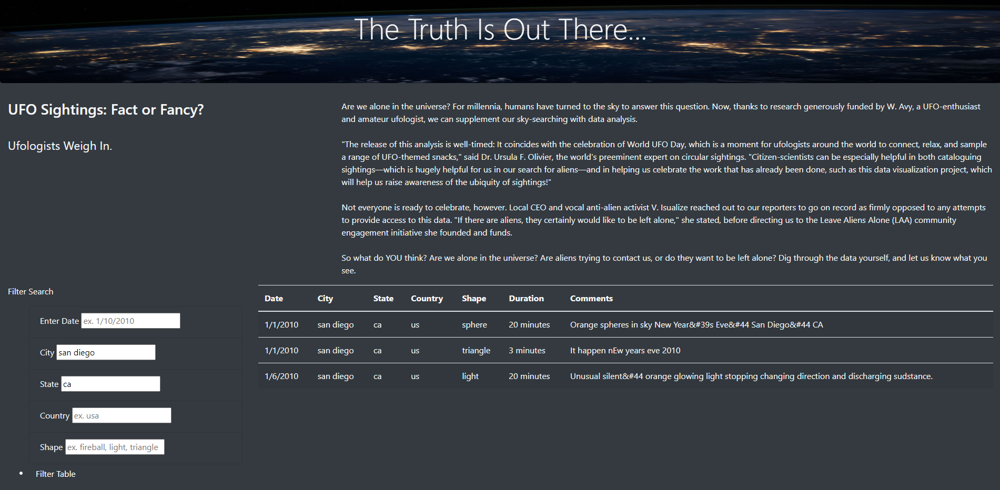

# The Truth is Out There!
## A UFO Analysis
### Overview:  Date has been gathered and filtered in order to discern whether there was any patterns that can be seen from the UFO report data.  The data contained locations, craft characteristics, and statement from the observer.
### Results:  The objective was to be able to create a filtering system that would allow the user to pull on certain values to find patterns of sightings.  In theory the user should be able to pull on, Date, City, State, Country, and Shape.  The data is then displayed in tables.  Unfortunately the code does not filter correctly.
### As can be see below there is a filter search…
## UFO GUI:

### Summary: Overall while having five filters is useful it is not as flexible as a text search in the report.  The text filter in addition to a “miles radius” may be useful.
